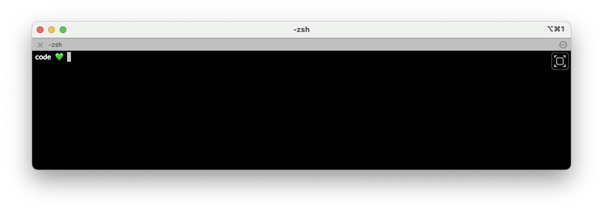

# Dotfiles

A comprehensive collection of configuration files for macOS development environment setup. This repository contains shell configurations, Git settings, package management, and macOS preferences to quickly set up a consistent development environment across machines.



## Table of Contents

- [Features](#features)
- [Prerequisites](#prerequisites)
- [Installation](#installation)
- [What's Included](#whats-included)
- [Utility Scripts](#utility-scripts)
- [Customization](#customization)
- [Maintenance](#maintenance)
- [Troubleshooting](#troubleshooting)
- [Uninstallation](#uninstallation)

## Features

- Zsh configuration with useful aliases and completions
- Git settings with helpful aliases and sensible defaults
- Homebrew packages for development tools and applications
- VS Code settings synchronization
- macOS system preferences optimization
- ASDF version manager setup for language runtimes
- iTerm2 configuration

## Prerequisites

- macOS (tested on Catalina, Big Sur, Monterey, and Ventura)
- Internet connection
- Administrator access to your machine

## Installation

### 1. Install Command Line Tools

This installs the necessary command line developer tools:

```sh
xcode-select --install
```

### 2. Install Homebrew

[Homebrew](https://brew.sh) is a package manager for macOS that we'll use to install other tools:

```sh
/bin/bash -c "$(curl -fsSL https://raw.githubusercontent.com/Homebrew/install/HEAD/install.sh)"
brew update
```

### 3. Install GitHub CLI

The GitHub CLI helps us clone repositories and manage GitHub features from the terminal:

```sh
brew install gh
```

### 4. Authenticate with GitHub

Once the GitHub CLI is installed, you need to authenticate:

```sh
gh auth login -s 'user:email' -w
```

Follow the prompts to complete authentication with your browser.

### 5. Clone the Dotfiles Repository

```sh
cd && gh repo clone meyclem/dotfiles
```

### 6. Personalize Git Configuration (Optional)

Before proceeding, you may want to update the Git user information in the gitconfig file:

```sh
# Open the file in your text editor
open -a TextEdit dotfiles/gitconfig

# Or with vim
vim dotfiles/gitconfig
```

Find and modify these lines with your information:

```toml
[user]
	email = your.email@example.com
	name = Your Name
```

### 7. Install Required Packages

This installs all applications and command line tools defined in the Brewfile:

```sh
brew bundle --file=dotfiles/Brewfile
```

### 8. Link Dotfiles

[RCM](https://github.com/thoughtbot/rcm) (installed via Brewfile in the previous step) manages symlinks for your dotfiles:

```sh
rcup -d dotfiles
```

This will create symlinks from the dotfiles in this repository to your home directory.

### 9. Restart Your Terminal

Close and reopen your terminal for all changes to take effect.

### 10. Fix Permissions (If Needed)

If you encounter warnings with `compaudit`, fix permissions with:

```sh
compaudit | xargs chown -R "$(whoami)"
compaudit | xargs chmod go-w
```

## What's Included

### Shell Configuration
- `zshrc` - Zsh configuration with useful shortcuts and settings
- `zsh/` - Additional Zsh configurations including aliases and completions

### Package Management
- `Brewfile` - Defines all packages, applications, and fonts to install

### Git Configuration
- `gitconfig` - Git aliases, colors, and default settings
- `gitignore` - Global Git ignore rules

### Editor Configuration
- `editorconfig` - Universal editor settings for consistent code formatting
- VS Code settings (automatically linked during installation)

### Tool Configuration
- `asdfrc` - ASDF version manager configuration
- `rcrc` - RCM configuration for dotfiles management
- `tool-versions` - Version specifications for language runtimes

## Utility Scripts

### First-Time Machine Setup

The `first_setup_machine` script configures additional components that should only be run once on a new machine:

```sh
first_setup_machine
```

This script:
- Installs and configures ASDF version manager
- Adds Node.js and Yarn plugins to ASDF
- Configures macOS system preferences:
  - Customizes the Touch Bar
  - Disables auto-correct
  - Enables fast key repeat
  - Optimizes Dock settings (auto-hide, size, etc.)
  - Configures Finder preferences

### Stack Update

The `stack-update` script keeps your development tools up to date:

```sh
stack-update
```

This script:
- Updates Homebrew and all installed packages
- Cleans up old versions of packages
- Updates ASDF and all its plugins
- Upgrades Mac App Store applications

Run this periodically to ensure your development environment stays current.

## Customization

### Local Overrides

You can create the following files to add your own customizations that won't be tracked by Git:

- `~/.zshrc.local` - Local Zsh settings
- `~/.gitconfig.local` - Local Git configuration

### Adding New Dotfiles

To add new configuration files to be managed:

1. Add the file to the repository
2. Run `rcup -d dotfiles` to update symlinks

## Maintenance

### Keeping Up to Date

To keep your dotfiles in sync across machines:

1. Pull the latest changes: `cd ~/dotfiles && git pull`
2. Update symlinks: `rcup -d dotfiles`
3. Run the stack update: `stack-update`

### Contributing Back

If you make improvements that might be useful across your machines:

1. Commit your changes: `git commit -am "Add new feature"`
2. Push to your repository: `git push`

## Troubleshooting

### Common Issues

- **Homebrew installation fails**: Make sure you have the latest macOS updates
- **RCM warnings**: Run the permission fix commands in step 10
- **Shell doesn't look right**: Make sure fonts are installed from the Brewfile

### Getting Help

If you encounter issues not covered here, check:
- Homebrew documentation: `brew help` or [brew.sh](https://brew.sh)
- RCM documentation: `man rcup` or [thoughtbot/rcm](https://github.com/thoughtbot/rcm)

## Uninstallation

To remove these dotfiles:

1. Remove the symlinks: `rcdn -d dotfiles`
2. Delete the repository: `rm -rf ~/dotfiles`
3. Restore any backups of your original files

Note: This won't uninstall applications or packages that were installed via Brewfile.
